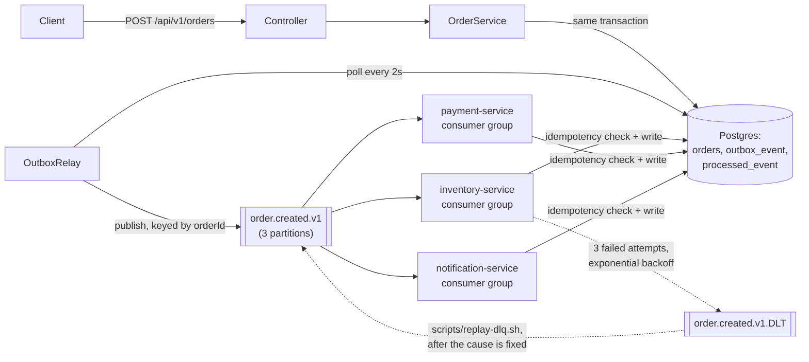

# kafka-order-processing — architecture

Three independent consumer **groups**, not three competing consumers on one group: each of
`inventory-service`, `payment-service` and `notification-service` gets its own full copy of every
`order.created.v1` event. That's the fan-out consumer groups give you — see
[ConsumerGroupsTest](../../examples/kafka-order-processing/src/test/java/dev/fgutierrez/dsplayground/kafkaorders/consumer/ConsumerGroupsTest.java).

The topic has 3 partitions; every publish is keyed by `orderId` (already true since
`examples/outbox`), so Kafka's default partitioner guarantees every event for the same order lands
on the same partition — ordering preserved per order, parallelism across orders. See
[PartitioningTest](../../examples/kafka-order-processing/src/test/java/dev/fgutierrez/dsplayground/kafkaorders/consumer/PartitioningTest.java).

Only `inventory-service` is wired with a controllable failure seam
(`InventoryAvailabilityChecker`) in this example, to demonstrate retry → DLT → replay without
repeating the same failure machinery three times for no additional teaching value — see
[PoisonMessageAndReplayTest](../../examples/kafka-order-processing/src/test/java/dev/fgutierrez/dsplayground/kafkaorders/consumer/PoisonMessageAndReplayTest.java).
