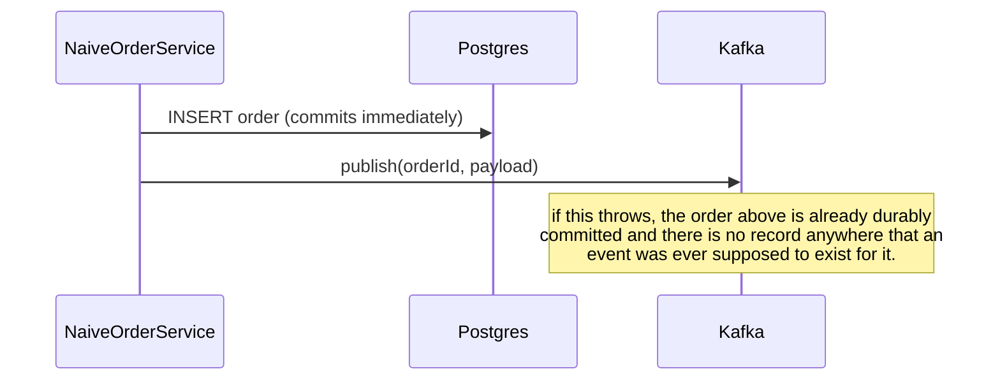

# outbox — architecture

```mermaid
sequenceDiagram
    participant Client
    participant OrderController
    participant OrderService
    participant Postgres as Postgres (orders, outbox_event)
    participant Relay as OutboxRelay (poll every 2s)
    participant Kafka as Kafka (order.created.v1)

    Client->>OrderController: POST /api/v1/orders
    OrderController->>OrderService: createOrder(customerId, lines)
    activate OrderService
    Note over OrderService,Postgres: single transaction
    OrderService->>Postgres: INSERT order + order_line + outbox_event (published_at = NULL)
    Postgres-->>OrderService: committed
    deactivate OrderService
    OrderController-->>Client: 201 Created

    loop every 2s
        Relay->>Postgres: SELECT ... WHERE published_at IS NULL ORDER BY created_at
        Postgres-->>Relay: pending rows
        loop each pending row
            Relay->>Kafka: send(topic, orderId, payload) — blocks for ack
            alt broker acks
                Kafka-->>Relay: ack
                Relay->>Postgres: UPDATE outbox_event SET published_at = now()
            else publish throws (simulated crash — see OutboxFailureTest)
                Relay--xRelay: batch stops here; row and everything after it stay pending
            end
        end
    end
```

The naive alternative (`NaiveOrderService`, exercised only by `NaiveDualWriteFailureTest`, never
wired into the controller) collapses the bottom half of this diagram into a single, unprotected step
straight after the `INSERT order` — no `outbox_event` row, no relay, no second chance:


