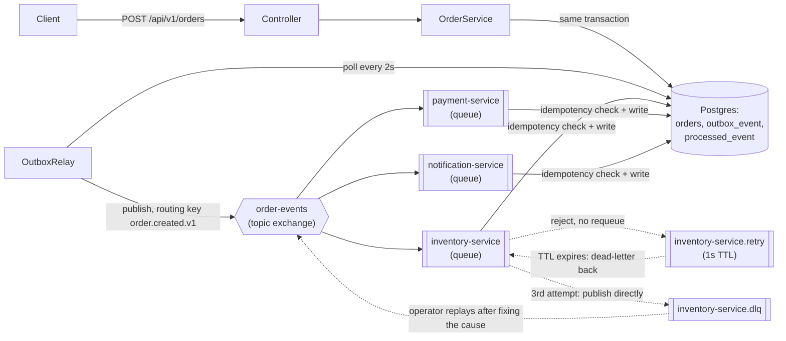

# rabbitmq-order-processing — architecture

Three **queues** bound to one **exchange** — the RabbitMQ shape of the fan-out
`kafka-order-processing`'s three consumer groups give: each queue gets its own full copy of every
`order.created.v1` message. See
[FanOutTest](../../examples/rabbitmq-order-processing/src/test/java/dev/fgutierrez/dsplayground/rabbitmqorders/consumer/FanOutTest.java).

Only `inventory-service` has the retry/DLX chain (dotted lines): a rejected message dead-letters to
a wait queue with a fixed TTL, which dead-letters it back to the main queue once the TTL expires —
entirely queue configuration (`RabbitConfig`), no manual retry-topic code the way Kafka needs. After
`MAX_ATTEMPTS`, `InventoryEventListener` gives up and publishes to the final DLQ itself, tracked via
RabbitMQ's own `x-death` header rather than an application-maintained counter. See
[PoisonMessageAndReplayTest](../../examples/rabbitmq-order-processing/src/test/java/dev/fgutierrez/dsplayground/rabbitmqorders/consumer/PoisonMessageAndReplayTest.java)
and [docs/adr/0006-retry-dlq-strategy.md](../adr/0006-retry-dlq-strategy.md).

RabbitMQ has no equivalent of Kafka's partitions — a queue is simply FIFO for whichever consumer(s)
are attached to it. There's deliberately no `PartitioningTest` counterpart here; see
[docs/adr/0007-kafka-vs-rabbitmq.md](../adr/0007-kafka-vs-rabbitmq.md) for why that's a real
difference, not a gap.
