# resilience — architecture

```mermaid
sequenceDiagram
    participant Client
    participant OrderController
    participant OrderService
    participant Postgres
    participant Gateway as ResilientShippingGateway
    participant Simulator as ShippingSimulator

    Client->>OrderController: POST /api/v1/orders
    OrderController->>OrderService: createOrder(...)
    Note over OrderService,Postgres: transaction ends here — <br/>the shipping call is deliberately outside it
    OrderService->>Postgres: INSERT order (+ lines)
    Postgres-->>OrderService: committed
    OrderController->>Gateway: requestShipment(orderId)

    rect rgb(40, 40, 40)
        Note over Gateway: CircuitBreaker → Bulkhead(THREADPOOL) → TimeLimiter
        alt circuit CLOSED, bulkhead has room, carrier fast
            Gateway->>Simulator: callCarrier(orderId)
            Simulator-->>Gateway: (instant)
            Gateway-->>OrderController: CONFIRMED
        else circuit CLOSED, carrier slow (> 500ms)
            Gateway->>Simulator: callCarrier(orderId)
            Note over Gateway: TimeLimiter interrupts after 500ms
            Gateway-->>OrderController: fallback() → PENDING_CONFIRMATION
        else circuit CLOSED, carrier failing
            Gateway->>Simulator: callCarrier(orderId)
            Simulator-->>Gateway: exception
            Gateway-->>OrderController: fallback() → PENDING_CONFIRMATION
            Note over Gateway: after enough failures,<br/>circuit trips OPEN
        else circuit OPEN
            Note over Gateway: short-circuits —<br/>never calls the carrier at all
            Gateway-->>OrderController: fallback() → PENDING_CONFIRMATION
        else bulkhead full
            Note over Gateway: rejected before<br/>even reaching the carrier
            Gateway-->>OrderController: fallback() → PENDING_CONFIRMATION
        end
    end

    OrderController-->>Client: 201 Created<br/>{ ..., shippingStatus }
```

Every branch through the shaded box ends the same way from the client's point of view: **`201
Created`**. The only thing that varies is `shippingStatus`. That's graceful degradation — see the
example [README §3](../../examples/resilience/README.md#3-improved-solution).

`NaiveShippingGateway` (used only by
[NaiveShippingGatewayFailureTest](../../examples/resilience/src/test/java/dev/fgutierrez/dsplayground/resilience/shipping/NaiveShippingGatewayFailureTest.java),
never wired into the controller) skips the whole shaded box: it calls `ShippingSimulator` directly,
so a slow carrier blocks the calling thread for exactly as long as the carrier takes — see
[README §2](../../examples/resilience/README.md#2-naive-solution).
