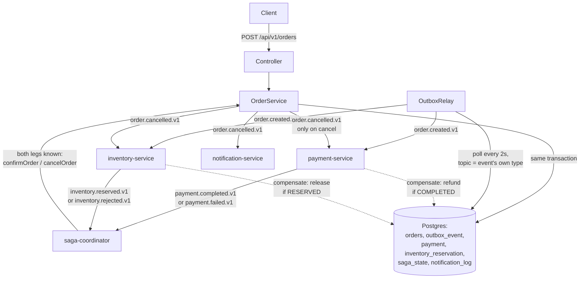

# saga-order-fulfillment — architecture

Four participants, one direction of control: **payment-service** and **inventory-service** react to
`order.created.v1` independently and in parallel — neither knows the other exists. **saga-coordinator**
only watches their outcome events (`SagaState`, one row per order) and, once both legs have reported,
tells `OrderService` to confirm or cancel. It never calls payment or inventory directly. That's what
makes this **choreography**, not orchestration — see [ADR 0008](../adr/0008-choreography-vs-orchestration.md).

On cancellation, `OrderService` publishes `order.cancelled.v1` the same way it publishes
`order.created.v1` — through the same outbox, to the same topic-per-participant fan-out shape as
`kafka-order-processing`. Payment and inventory each react to it as *their own* compensation trigger
(refund / release), each idempotent via the same existence/status check used for the initial
processing. `notification-service` reacts to it too, but has no state to compensate — it just tells
the customer.

**Failure scenario 5** (payment completes, inventory rejects) is the one this example exists to prove:
[SagaCompensationTest](../../examples/saga-order-fulfillment/src/test/java/dev/fgutierrez/dsplayground/saga/saga/SagaCompensationTest.java)
forces the rejection via `InventoryAvailabilityChecker`, then uses Awaitility to assert that — with no
fixed sleep, no assumption about ordering — the order, the payment, and the inventory reservation all
converge to their correct terminal state within a bounded time. See
[ADR 0009](../adr/0009-eventual-consistency.md) for what "converges" is actually guaranteeing.
