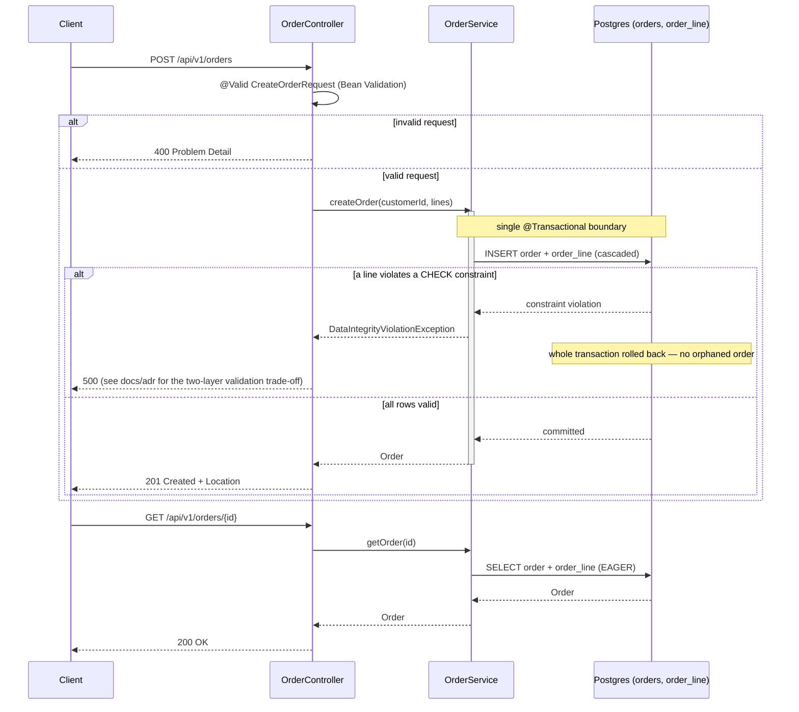

# synchronous-processing — architecture

Two validation layers, deliberately: Bean Validation on `CreateOrderRequest` (`@Positive`, `@NotBlank`,
`@NotEmpty`) rejects bad input before it ever reaches the database — that's what a real client hits.
The database's own `CHECK (quantity > 0)` / `CHECK (unit_price > 0)` constraints on `order_line` are a
second, independent line of defense, proven by `OrderTransactionBoundaryTest`, which bypasses the API
layer on purpose to show that even then, the whole order is rolled back atomically rather than left
half-written.
